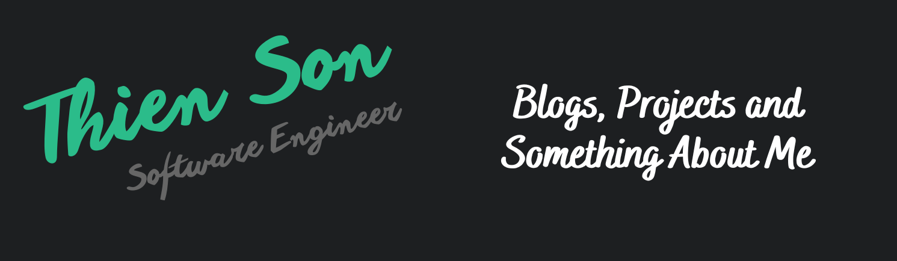

## 🌱 About me

 Hi there  

 My name's Thien Son, I'm living in Da Lat city, Viet Nam.
 

 Glad to see you here! 

 
 
## 🔧 Technologies & Tools

<code></code> 
<code></code> <code></code>
<code></code> 
<code></code> 
<code></code>

 

## &#x270d; Blog & Writing

Apart from coding, I also maintain a blog - you can find my articles on my website at

## &#x1f4c8; GitHub Stats
 

  

 

  
  

 

